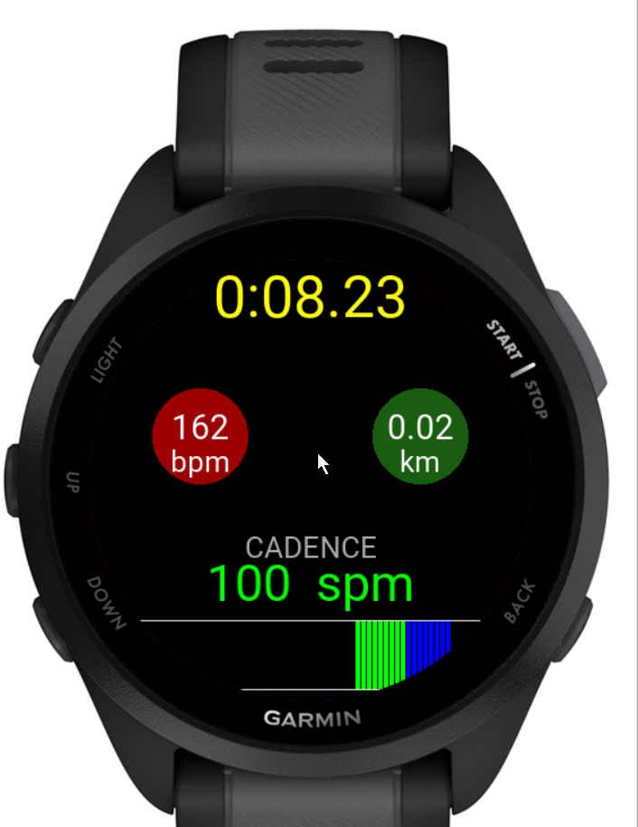

# garmin-smartwatch
This is an app for the Garmin Forerunner 165, which allows a user to specify a cadence zone and be alerted when their running falls outside the zone.
The watch will vibrate as well as give visual display of the runners progress.

